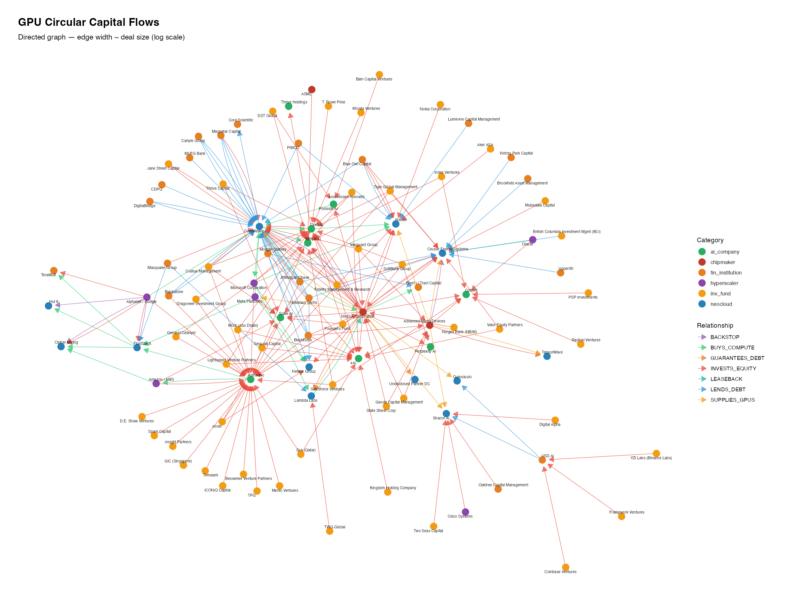

```{r setup, include=FALSE}
knitr::opts_chunk$set(echo = FALSE, warning = FALSE, message = FALSE,
                      fig.width = 7.5, fig.asp = 0.618, dpi = 300,
                      fig.align = "center", fig.pos = "H", out.width = "90%")
library(ggplot2)
library(knitr)
library(kableExtra)
library(dplyr)
library(scales)

pal_red    <- "#B71C1C"
pal_blue   <- "#2C5F8A"
pal_dark   <- "#2C3E50"
pal_orange <- "#C05621"
pal_grey   <- "#7f8c8d"
pal_green  <- "#27ae60"

theme_oa <- function(base_size = 11) {
  theme_minimal(base_size = base_size) %+replace%
    theme(
      text          = element_text(color = pal_dark),
      plot.title    = element_text(face = "bold", size = base_size + 1, hjust = 0,
                                   margin = margin(b = 4)),
      plot.subtitle = element_text(color = pal_grey, size = base_size - 1, hjust = 0,
                                   margin = margin(b = 10)),
      plot.caption  = element_text(color = pal_grey, size = base_size - 3,
                                   hjust = 1, margin = margin(t = 6)),
      axis.title    = element_text(size = base_size - 1),
      axis.text     = element_text(color = pal_dark, size = base_size - 2),
      panel.grid.major.x = element_blank(),
      panel.grid.minor   = element_blank(),
      panel.grid.major.y = element_line(color = "#e8e8e8", linewidth = 0.35),
      legend.position    = "top",
      legend.title       = element_blank(),
      plot.margin        = margin(10, 14, 8, 10)
    )
}
```

# Purpose and relationship to the main paper

The main paper documents three measurement channels (ASC 360 depreciation, ASC 606/718 customer warrants, ASC 842 uncommenced leases) using CoreWeave's FY2025 10-K. For *Accounting Horizons* length, extended institutional and technical material is placed here. Appendix A of the main paper (ROIC, WACC, lease PV) is **not** duplicated.

| OA section | Main-paper pointer |
|---|---|
| OA.1 Market chronology | §2.3 |
| OA.2 Circular-flow map | §2.2--2.3, §3.1 |
| OA.3 Extended facilities | §4.1 Table 1 |
| OA.4 Warrant technical notes | §5.2 |
| OA.5 Fire-sale / short-life pricing | §5.4 |

Supporting raw materials (schema, network build scripts, fire-sale framework notes) are in the `data/` folder of this repository.

\newpage

# Market chronology and accumulation

GPU-collateralized lending filled a financing gap: AI infrastructure firms needed billions for NVIDIA GPUs without conventional bank access. The watershed was CoreWeave's August 2023 \$2.3 billion delayed-draw term loan (DDTL) led by Magnetar Capital and Blackstone Tactical Opportunities, with participation from BlackRock, PIMCO, Carlyle, Coatue, and DigitalBridge Credit [@coreweave2023ddtl]. Secured by NVIDIA GPUs and long-term customer contracts, that facility set the sector template.

Scaling was rapid. Crusoe borrowed \$200 million in October 2023 against approximately 20,000 GPUs. Lambda secured a \$500 million GPU financing SPV in April 2024. CoreWeave closed DDTL 2.0 at \$7.5 billion in May 2024. By late 2024, sector GPU debt exceeded \$11 billion [@ft2024gpudebt]. Through 2025--early 2026: FluidStack / Macquarie capacity above \$10 billion; Nscale \$1.4 billion European DDTL; Crusoe \$300 million AMD-guaranteed loan (first major non-NVIDIA facility); Firmus \$10 billion authorized for Australian AI infrastructure [@bloomberg2026nscale]. In March 2026 CoreWeave pursued Meta-backed DDTL 4.0 at approximately SOFR+225 bps, supported by more than \$19 billion in Meta contracts [@bloomberg2026f].

```{r fig-waterfall, fig.height=8.5, fig.width=7}
#| fig-cap: "GPU-collateralized debt accumulation by instrument type, Aug 2023--Mar 2026. Amounts are drawn or committed (not authorized limits). DDTL 4.0 (Meta-backed) pending as of March 2026."
wf <- data.frame(
  deal = c(
    "Aug '23: CoreWeave DDTL 1.0",
    "Oct '23: Crusoe / Upper90",
    "Apr '24: Lambda ABS",
    "May '24: CoreWeave DDTL 2.0",
    "May '25: CoreWeave 9.25% Sr. Notes",
    "Jul '25: CoreWeave DDTL 3.0",
    "Sep '25: CoreWeave DDTL 2.1",
    "Jul '25: CoreWeave 9.00% Sr. Notes",
    "Dec '25: CoreWeave Convertibles",
    "2025: FluidStack / Macquarie",
    "Feb '26: Nscale European DDTL",
    "Jan '26: Sharon AI / USD.AI",
    "Feb '26: AMD-Crusoe (Goldman Sachs)",
    "Mar '26: CoreWeave DDTL 4.0 (Meta)",
    "TOTAL"
  ),
  amount = c(2.3, 0.2, 0.5, 7.5, 2.0, 2.6, 3.0, 1.75, 2.25, 2.5, 1.4, 0.5, 0.3, 8.5, NA),
  dtype  = c("DDTL", "DDTL", "ABS/SPV", "DDTL", "Sr. Notes", "DDTL", "DDTL",
             "Sr. Notes", "Convertible", "DDTL", "DDTL", "Vendor-backed", "Vendor-backed", "DDTL", "Total"),
  stringsAsFactors = FALSE
)
n <- nrow(wf)
wf$is_total <- c(rep(FALSE, n - 1), TRUE)
wf$cumul    <- c(0, cumsum(wf$amount[seq_len(n - 1)]))
wf$xmin     <- wf$cumul
wf$xmax     <- wf$cumul + ifelse(is.na(wf$amount), 0, wf$amount)
wf$xmax[n]  <- sum(wf$amount, na.rm = TRUE)
wf$xmin[n]  <- 0
wf$deal     <- factor(wf$deal, levels = rev(wf$deal))
wf$dtype    <- factor(wf$dtype,
                      levels = c("DDTL", "ABS/SPV", "Sr. Notes",
                                 "Convertible", "Vendor-backed", "Total"))
type_pal <- c(
  "DDTL" = pal_blue, "ABS/SPV" = pal_green, "Sr. Notes" = pal_dark,
  "Convertible" = pal_orange, "Vendor-backed" = "#8e44ad", "Total" = "#1a252f"
)
wf$ypos <- as.numeric(wf$deal)

ggplot(wf) +
  geom_rect(aes(xmin = xmin, xmax = xmax, ymin = ypos - 0.38, ymax = ypos + 0.38, fill = dtype),
            color = "white", linewidth = 0.40) +
  geom_text(aes(x = xmax + 0.35, y = ypos,
                label = ifelse(is_total, paste0("$", round(xmax, 1), "B TOTAL"),
                               paste0("+$", amount, "B"))),
            size = 2.7, fontface = "bold", color = pal_dark, hjust = 0) +
  scale_fill_manual(values = type_pal, name = "Instrument") +
  scale_y_continuous(breaks = seq_along(levels(wf$deal)), labels = levels(wf$deal),
                     expand = expansion(add = 0.6)) +
  scale_x_continuous(labels = dollar_format(suffix = "B"),
                     expand = expansion(mult = c(0, 0.22)), breaks = seq(0, 40, 5)) +
  labs(title = "From Zero to $35 Billion in Three Years",
       subtitle = "Major GPU-collateralized facilities by instrument type, Aug 2023 -- Mar 2026",
       x = "Cumulative outstanding debt ($B)", y = NULL,
       caption = "Source: Company filings, Financial Times, Bloomberg, author compilation") +
  theme_oa() +
  theme(legend.position = "bottom", panel.grid.major.y = element_blank(),
        axis.text.y = element_text(size = 7.5, hjust = 1))
```

**Instrument taxonomy.** DDTLs pair GPU collateral with contracted revenue. Vendor-backed guarantees (NVIDIA capacity backstops; AMD's Crusoe guarantee) transfer collateral risk back to the product-cycle originator. Senior notes are fixed-rate refinancing; convertibles trade coupon for dilution; ABS / tokenized structures push chip credit to investors furthest from technology risk. Each structure allocates useful-life, demand, and refinancing risk to a different balance sheet---which is why measurement of those exposures matters for reporting and credit analysis.

\newpage

# Circular-flow network of counterparties

The contract chain is not linear. The same counterparties can appear as suppliers, customers, equity investors, guarantors, and lenders. A simplified chain:

1. **NVIDIA** sells GPUs to CoreWeave under take-or-pay arrangements.
2. **CoreWeave** pledges GPUs as collateral through ring-fenced SPVs.
3. **SPVs** secure private-credit debt.
4. **Lenders** (Blackstone, PIMCO, Magnetar, and others) fund facilities backstopped by hyperscaler contracts.
5. **Hyperscalers** (Microsoft, Meta, Oracle, and others) guarantee or anchor revenue via take-or-pay compute contracts.
6. Customer revenue services the debt; collateral values depend on NVIDIA's product cycle; NVIDIA revenue depends on continued neocloud purchases.

The circularity creates correlated default risk: standard models that treat defaults as independent are misspecified for this structure. Historical analogy: @carpenter2023cisco documents Cisco's vendor-financing boom and subsequent write-offs when demand failed---the vendor financed its own demand.

```{r fig-circular-simple, fig.height=4.2, fig.width=6.5}
#| fig-cap: "Simplified circular contract chain in GPU lending. Full directed network graph from the curated relationship database is shown next."
nodes <- data.frame(
  label = c("NVIDIA\n(Supplier)", "CoreWeave\n(Borrower)", "SPV\n(Ring-fenced)",
            "Lenders\n(PC funds)", "Hyperscalers\n(MSFT / Meta)",
            "Revenue\n(Contracts)"),
  x = c(3, 5, 5, 3, 1, 1),
  y = c(3, 3, 1, 1, 1, 3),
  cat = c("chipmaker", "neocloud", "spv", "lender", "hyperscaler", "revenue"),
  stringsAsFactors = FALSE
)
arrows <- data.frame(
  x = c(3.4, 5, 5, 3.8, 1, 1), y = c(3, 2.6, 1, 1, 1.4, 3),
  xend = c(4.6, 5, 3.8, 1.4, 1, 2.6), yend = c(3, 1.4, 1, 1, 2.6, 3)
)
cat_cols <- c(chipmaker = "#C0392B", neocloud = "#2980B9", spv = "#7F8C8D",
              lender = "#E67E22", hyperscaler = "#8E44AD", revenue = "#27AE60")
ggplot() +
  geom_segment(data = arrows, aes(x = x, y = y, xend = xend, yend = yend),
               arrow = arrow(length = unit(3, "mm"), type = "closed"),
               color = pal_grey, linewidth = 0.8) +
  geom_label(data = nodes, aes(x = x, y = y, label = label, fill = cat),
             size = 2.8, fontface = "bold", color = "white",
             label.padding = unit(0.4, "lines"), label.r = unit(0.2, "lines")) +
  scale_fill_manual(values = cat_cols) +
  coord_fixed(xlim = c(0, 6), ylim = c(0.3, 3.7)) +
  theme_void() + theme(legend.position = "none") +
  labs(title = "Circular contract chain in GPU lending")
```

```{r fig-full-network, out.width="95%", fig.cap="Full circular-flow network constructed from documented financing, supply, equity, and capacity-backstop relationships (author-curated database). Build scripts and schema: online-appendix/data/."}
if (file.exists("figures/circular_flow_graph.png")) {
  
} else if (file.exists("figures/fig-full-network-1.pdf")) {
  knitr::include_graphics("figures/fig-full-network-1.pdf")
}
```

**Bankruptcy remoteness.** CoreWeave DDTLs sit in wholly owned SPVs (e.g., CoreWeave Compute Acquisition Co. entities) with perfected first-priority security interests in GPUs, contracts, and SPV equity (10-K Note 10). Whether that structure survives Chapter 11---automatic stay under 11 U.S.C. §362; substantive consolidation---is untested. Take-or-pay enforceability is a separate vulnerability: termination provisions for material breach, delivery failure, and financing contingencies mean \$60.7 billion of remaining performance obligations is contractual face value, not risk-adjusted cash flow.

Repository files: `data/circular_flow_schema.sql`, `data/build_circular_flow_db.py`, `data/circular_flow_graph.R`, `data/circular_flow_research.md`.

\newpage

# Extended facility-level detail

Main-paper Table 1 summarizes CoreWeave's twelve instruments (\$21.6 billion drawn). The table below expands to sector facilities with dates, maturities, rates, and sources where available.

```{r tbl-full-facilities}
full_fac <- data.frame(
  Borrower = c("CoreWeave", "CoreWeave", "CoreWeave", "CoreWeave", "CoreWeave",
               "CoreWeave", "CoreWeave", "CoreWeave", "CoreWeave", "CoreWeave",
               "CoreWeave", "CoreWeave",
               "Applied Digital", "Applied Digital", "Lambda Labs", "Crusoe Energy",
               "Crusoe Energy", "FluidStack", "Nscale", "Sharon AI", "Firmus",
               "CoreWeave"),
  Facility = c("DDTL 1.0", "DDTL 2.0", "DDTL 2.1", "DDTL 3.0",
               "2030 Sr. Notes", "2031 Sr. Notes", "2031 Convertible",
               "Conv. Promissory", "RCF", "OEM/Software",
               "Magnetar Loan", "2024 Term Loan",
               "Sr. Secured 9.25\\%", "Convertible 2.75\\%",
               "ABS/SPV", "Term Loan",
               "AMD-backed", "DDTL (Macquarie)", "European DDTL", "Tokenized (USD.AI)",
               "Infrastructure DDTL",
               "DDTL 4.0 (Meta)"),
  Amount = c("\\$1,553M", "\\$5,037M", "\\$2,741M", "\\$340M",
             "\\$2,000M", "\\$1,750M", "\\$2,588M",
             "\\$168M", "\\$1,000M", "\\$4,165M",
             "\\$273M", "Repaid",
             "\\$2,350M", "\\$375M", "\\$500M", "\\$200M",
             "\\$300M", "\\$2.5B drawn", "\\$1,400M", "\\$500M auth",
             "\\$10B auth",
             "\\$8,500M (pending)"),
  Date = c("Jul 2023", "May 2024", "Sep 2025", "Jul 2025",
           "May 2025", "Jul 2025", "Dec 2025",
           "Oct 2025", "Pre-IPO", "Various",
           "2025", "2024",
           "2024", "Oct 2024", "Apr 2024", "Oct 2023",
           "Feb 2026", "2025", "Feb 2026", "Jan 2026", "Feb 2026",
           "Mar 2026"),
  Maturity = c("Mar 2028", "Aug 2030", "Dec 2030", "Aug 2030",
               "Jun 2030", "Feb 2031", "Dec 2031",
               "Apr 2026", "Nov 2029", "Mar 26--Jul 30",
               "Jan 2029", "Apr 2025",
               "NR", "NR", "NR", "NR", "NR", "NR", "NR", "NR", "NR",
               "Pending / not disclosed"),
  Rate = c("15\\%", "10\\%", "9\\%", "9\\%",
           "9.25\\%", "9.00\\%", "1.75\\%",
           "7\\%", "6\\%", "10\\%",
           "12\\%", "12\\%",
           "9.25\\%", "2.75\\%", "NR", "NR",
           "~6\\%", "NR", "NR", "NR", "NR",
           "SOFR+225"),
  Source = c("10-K", "10-K", "10-K", "10-K",
             "10-K", "10-K", "10-K",
             "10-K", "10-K", "10-K",
             "10-K", "10-K",
             "APLD filings", "APLD filings", "Press", "Press",
             "Bloomberg", "Press", "Press", "Press", "Press",
             "Bloomberg"),
  stringsAsFactors = FALSE
)

kable(full_fac, "latex", booktabs = TRUE, escape = FALSE,
      caption = "Extended GPU-collateralized facility data. Amounts are drawn or committed unless noted. CoreWeave rows (highlighted in source data) total \\$21.6B drawn principal in the main paper.",
      col.names = c("Borrower", "Facility", "Outstanding", "Date", "Maturity", "Rate", "Source"),
      align = "llrlllr") %>%
  kable_styling(latex_options = c("HOLD_position", "scale_down"), font_size = 7) %>%
  row_spec(0, bold = TRUE)
```

\newpage

# Warrant classification and fair-value technical notes

Main-paper §5.2 reports measurement outcomes for AMD's Meta and OpenAI warrants under ASC 606-10-32-25 and ASC 718 as clarified by ASU 2025-04. This section records classification and valuation notes omitted for length.

## Liability versus equity classification

Under ASC 718-10-35-2, share-based payments classified as **liabilities** are remeasured at fair value each period; **equity** awards are measured at grant date. AMD's warrants have a fixed share count (320 million) and fixed exercise price (\$0.01), consistent with equity classification under ASC 480 and ASC 815-40 if freestanding (instrument indexed to AMD's own stock). If equity-classified, the revenue reduction is fixed at measurement date; if liability-classified (e.g., because milestone vesting makes the number of shares variable in a way that fails equity classification), the reduction marks to market each period. AMD has not disclosed classification or net-of-warrant revenue.

## Intrinsic value versus option value

The main paper's \$61.8 billion figure is **intrinsic value** at approximately \$193 per share (March 2026): \((193 - 0.01) \times 320\) million. Under ASC 718-10-30-2, nonemployee awards are measured at fair value, which for warrants generally requires an option model. For deep-in-the-money penny warrants, Black--Scholes converges to intrinsic value: with roughly 50\% equity volatility, five-year term, and 4.25\% risk-free rate, model value per warrant is approximately \$192.60 versus intrinsic \$192.99 (difference < 0.3\%). Intrinsic value is therefore an appropriate approximation here; higher strikes or shorter terms would reopen the gap.

## Measurement-date discipline

ASC 718 measures equity-classified customer awards at **grant-date** fair value. Public filings do not disclose a grant-date valuation, and vesting schedules (8-K Exhibits E and F) are redacted. Main-paper magnitudes at March 2026 prices are therefore **post-grant sensitivities** that scale linearly with the measurement-date price---not a claim that grant-date fair value equals \$61.8 billion.

## NVIDIA capacity backstop as a parallel ASC 606 question

NVIDIA's commitment to purchase up to \$6.3 billion of unsold CoreWeave capacity through April 2032 (CoreWeave 10-K Note 15) is a service-form consideration-payable question under ASC 606-10-32-25, not an ASC 718 equity instrument. We flag it as an emerging parallel; full analysis is beyond this appendix.

\newpage

# Fire-sale recovery and short-life pricing

Main-paper §5.4 reports credit metrics and rental-rate evidence. This section extends the fire-sale and reduced-form pricing discussion.

## Fire-sale counterargument and why GPUs differ from aircraft

@franks2022decomposing decompose the raw 18\% discount on aircraft sold by distressed airlines: under-maintenance explains roughly half; the residual 9--11\% liquidity discount transfers value from seller to buyer rather than destroying it; Chapter 11 patient-sale provisions limit misallocation. That evidence warns against overstating welfare costs of fire sales. It does **not** rescue GPU collateral recovery:

1. **Welfare vs. recovery.** The lender recovers the realized price; quality and liquidity components both reduce recovery.
2. **Endogenous quality.** Covenant-stressed operators defer maintenance, cooling, and refurbishment exactly when the lender relies on collateral.
3. **Missing institutions.** No Section 1110 analog, no lessor class that redeploys hardware to final users, no standardized maintenance records, and generational displacement is a secular shock---collateral value need not mean-revert while a patient seller waits [@shleifer1992liquidation; @pulvino1998do].

Additional framework notes: `data/GPU_FIRE_SALE_RISK_FRAMEWORK.md`.

## Pricing the short-life state

Bound the market-assigned probability of the short-life state with the reduced-form identity $\Delta s = p \times L$: the spread differential between GPU-backed and comparable credit compensates incremental expected loss on GPU collateral [@jarrow1995pricing; @duffie1999modeling].

Two observed differentials:

| Differential | Source | Implied short-life state price |
|---|---|---|
| ~10 bp GPU-backed vs non-AI private credit | [@bis2026bulletin120] | At 40--60\% loss severity: ~0.2--0.3\% per year (<1.5\% cumulative over five years) |
| 400--600 bp concession avoided via Meta enhancement | [@bloomberg2026f] | ~7--15\% per year on the unenhanced alternative |

Enhanced facilities price the short-life state near zero; the unenhanced market prices it an order of magnitude higher. Two contemporaneous prices on the same collateral class, differing only in which balance sheet absorbs the short-life state, identify that state price. Risk premia push risk-neutral figures above physical probabilities, so the 0.2--0.3\% figure is an upper bound on physical probability under that spread. @duffie2001term predict wider spreads when investors observe asset value through imperfect accounting---the three measurement gaps in the main paper are that imperfection, yet average observed unenhanced-vs-enhanced wedges remain large.

# References
